## Documentation

### Introduction

Thanks for installing Aclibris!

I hope this application will prove useful and entertaining in some way or another, because it was just as fun developing it as using during its testing period.

This documentation provides the basic instructions you need to take full advantage of all the application's features.

### Table of Contents
- [Introduction](#introduction)
- [Adding your first book](#adding-your-first-book)
- [Smooth read](#smooth-read)
- [Organisation](#organisation)
- [Search & Filter](#search-and-filter)
- [Settings](#settings)

#### Adding your first book

When you start the application, you will see the **Home** page.

To upload your first book, you can either click on the `Upload Your First Book` button in the _center_ of the **Home** page, or you can navigate to the same page using the `Upload Book` **side menu** button.

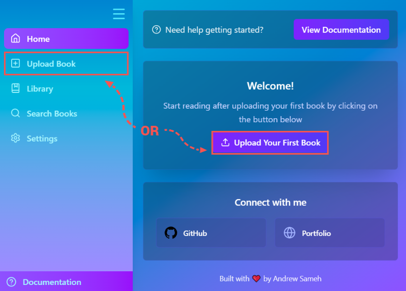

Once the **Upload** page is loaded, you will see a section at the top of the page where you can upload your first book.

You can drag and drop your book file directly into this section. Alternatively, clicking on the section will open the _File Explorer_, allowing you to select the file from your computer.

> [!IMPORTANT]
>
> All files that you upload can **_only_** be **.pdf** files

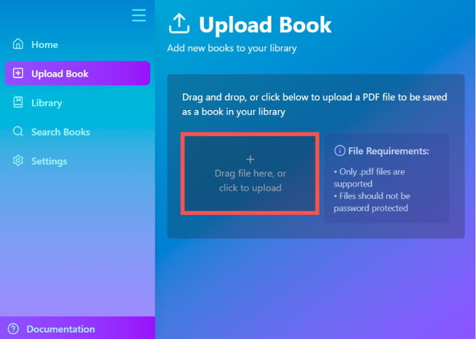

On successful upload, the section will turn _green_ and display an option to remove the file if you wish to replace it.

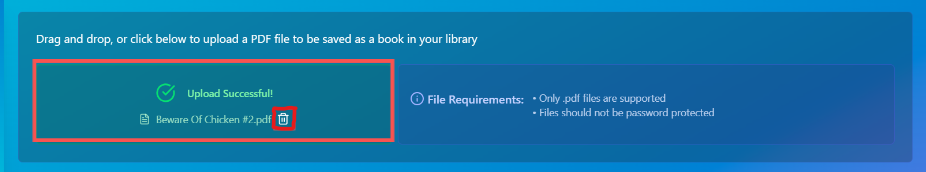

Once the upload is complete, two new sections will appear below: **_File Information_** and **_Organisation_**.

In the File Information section, **6** fields will show basic information that we already saved within the uploaded PDF's metadata, including:

- Title: _Can be edited_
- Author: _Can be edited_
- Pages: _Read only_
- File Size: _Read only_
- Creation date: _Read only_ 

The final field is the **thumbnail**, which is a screenshot of the first page of your PDF. You can disable this feature from the **Settings** page.

Check out [Setting up preferences]() for more information.

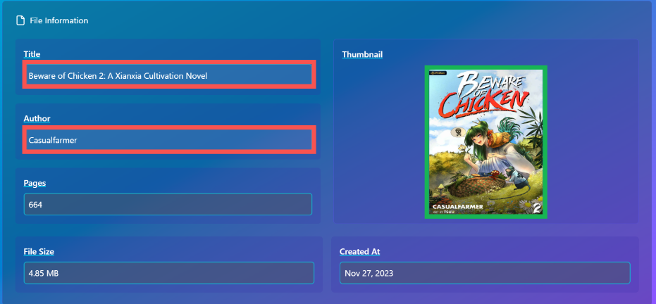

In the Organisation section, set the **Collection** as `Default` for now.

As this is a tutorial for adding your first book, advanced organisation is not necessary. However, organisation is a _significant_ feature within the application.

You can learn more about organisation methods from [Organisation](#organisation) section.

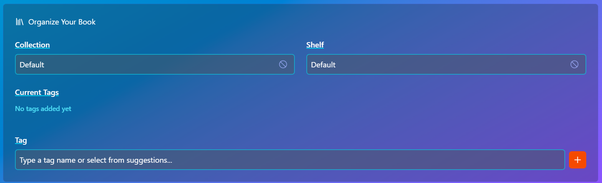

Click on `Save Book` to save your first book!

Now to read your first book, you can access it through the **Library** page. 

After saving, you will be automatically redirected to the **Library** page. You can also navigate there at any time using the `Library` **side menu** button.

You should see a `Default` **shelf** containing a `Default` **collection**. Click on the collection to open it.

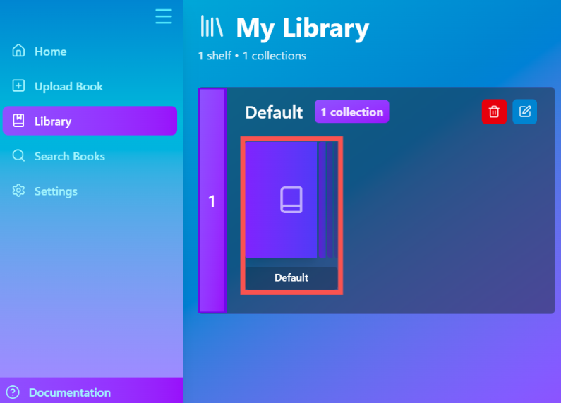

This is the **Collection** page, which displays all books stored within the collection you selected.

Here you can select a book to read, and its details will show on the _left-hand_ side of the screen (or at the _top_, depending on your window resolution).

The book details section shows all the information saved from the **Upload** page, along with **2** buttons: `Read This Book` and `Edit Book`.

Click on the `Read This Book` button to read your first book!

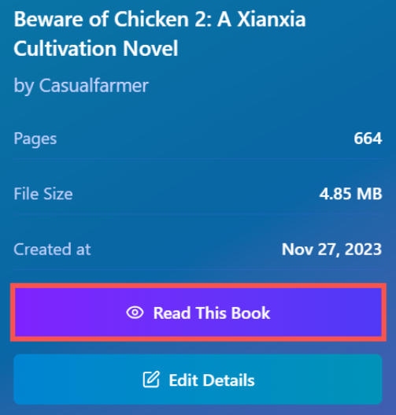

You can now upload more books and know where to read them.

It is recommended to learn more about organising your books in the [Organisation](#organisation) section, 
or go to the next section [Smooth read](#smooth-read) to learn more about the features available on the **View** page.

#### Smooth read

Aftering opening a book, you are directed to the **View** page, the heart of the application.

Any book you open will render **_page by page_**, and the open page will fill the entire preview area, as highlighted below.

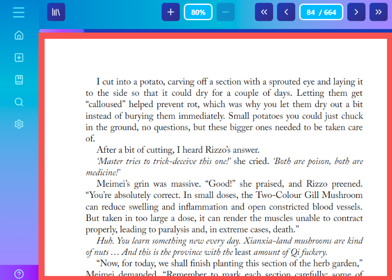

Above the preview, you can see several controls for navigating and adjusting the content.

On the far left is the `Library` <svg xmlns="http://www.w3.org/2000/svg" width="24" height="24" viewBox="0 0 24 24" fill="none" stroke="currentColor" stroke-width="2" stroke-linecap="round" stroke-linejoin="round" class="lucide lucide-library-icon lucide-library"><path d="m16 6 4 14"/><path d="M12 6v14"/><path d="M8 8v12"/><path d="M4 4v16"/></svg> button, which  returns you to the **Library** page. You can consider it the exit button of the page.

On the far right are the **page controls**, where you can navigate the book you are currently viewing.

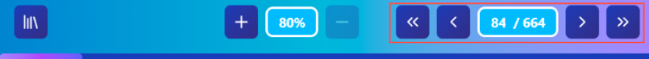

Here are the control functions in order, assume a book has _n_ total pages and you are currently viewing page _c_ :

- Turn to **First** <svg xmlns="http://www.w3.org/2000/svg" width="15" height="15" viewBox="0 0 24 24" fill="none" stroke="currentColor" stroke-width="2" stroke-linecap="round" stroke-linejoin="round" class="lucide lucide-chevrons-left-icon lucide-chevrons-left"><path d="m11 17-5-5 5-5"/><path d="m18 17-5-5 5-5"/></svg>

    Jumps to **page 1**.

- Turn to **Previous** <svg xmlns="http://www.w3.org/2000/svg" width="15" height="15" viewBox="0 0 24 24" fill="none" stroke="currentColor" stroke-width="2" stroke-linecap="round" stroke-linejoin="round" class="lucide lucide-chevron-left-icon lucide-chevron-left"><path d="m15 18-6-6 6-6"/></svg>

    Goes to the previous page, **page _c_ - 1** ( _c_ > 1 ) of the book.

- Page Count ( _c_ / _n_ )

    You can click on the highlighted area to edit the page number directly. The number must be between **1** and _n_.

    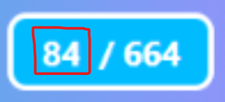

- Turn to **Next** <svg xmlns="http://www.w3.org/2000/svg" width="15" height="15" viewBox="0 0 24 24" fill="none" stroke="currentColor" stroke-width="2" stroke-linecap="round" stroke-linejoin="round" class="lucide lucide-chevron-right-icon lucide-chevron-right"><path d="m9 18 6-6-6-6"/></svg>

    Advances to the next page, **page _c_ + 1** ( _c_ < _n_ ) of the book.

- Turn to **Last** <svg xmlns="http://www.w3.org/2000/svg" width="15" height="15" viewBox="0 0 24 24" fill="none" stroke="currentColor" stroke-width="2" stroke-linecap="round" stroke-linejoin="round" class="lucide lucide-chevrons-right-icon lucide-chevrons-right"><path d="m6 17 5-5-5-5"/><path d="m13 17 5-5-5-5"/></svg>

   Jumps to the **last page** (page _n_).

There is also a **zoom** in and out feature, which you can controls using the buttons highlighted.

- The minimum zoom is **100%** and the maximum is **200%** when the window is fullscreen.

- For smaller windows, the minimum zoom is **80%** and the maximum is **100%**.

- Click the <svg xmlns="http://www.w3.org/2000/svg" width="15" height="15" viewBox="0 0 24 24" fill="none" stroke="currentColor" stroke-width="2" stroke-linecap="round" stroke-linejoin="round" class="lucide lucide-plus-icon lucide-plus"><path d="M5 12h14"/><path d="M12 5v14"/></svg> (plus) button to zoom in.

- Click the <svg xmlns="http://www.w3.org/2000/svg" width="15" height="15" viewBox="0 0 24 24" fill="none" stroke="currentColor" stroke-width="2" stroke-linecap="round" stroke-linejoin="round" class="lucide lucide-minus-icon lucide-minus"><path d="M5 12h14"/></svg> (minus) button to zoom out.

These are all the current features on the **View** page, more are expected to come.

Happy reading!

#### Organisation

In this application, there are currently **3** different methods that you can utilise to organise your books.

The inspiration is from a library shelf. **Shelves** represent genres, **Collections** represent series and **Tags** are well ....tags.

You are not obligated to follow this analogy strictly, but it provides a useful framework.

The **Library** page will by default have one shelf `Default` and within it one collection `Default`.

**Shelves** and **Collections** can only be created in the **Upload** page or on [**book details**](#book-details) edit. When selecting a shelf or a collection, you can choose from existing ones using the drop-down menu. Alternatively, typing a _new name_ will automatically create it for you.

- Each **shelf** can hold multiple **collections**. You can rename or delete a shelf using the buttons highlighted below.

    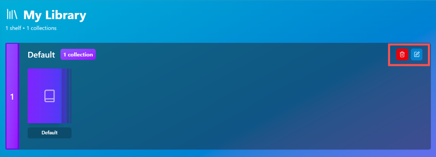

- Each **collection** can contain multiple books. You can rename or delete a collection using the buttons highlighted below.

    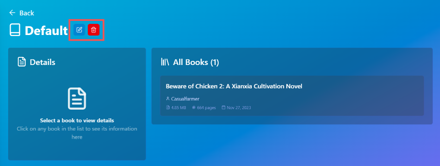

> [!IMPORTANT]
>
> Deleting a shelf or a collection will **_permanently remove_** **all** books contained within it from your library.

**Tags** are _labels_ that can be attached to books individually.

Tags are flexible labels you can attach to individual books. They are useful for identifying themes and content, which helps with searching and filtering on the **Search** page. See [Search & Filter](#search-and-filter) for more information.

Similar to **shelves** and **collections**, **tags** can be added from the **Upload** page or the [**book details**](#book-details). 

To add a **tag**, type its name into the field and click the <svg xmlns="http://www.w3.org/2000/svg" width="15" height="15" viewBox="0 0 24 24" fill="none" stroke="currentColor" stroke-width="2" stroke-linecap="round" stroke-linejoin="round" class="lucide lucide-plus-icon lucide-plus"><path d="M5 12h14"/><path d="M12 5v14"/></svg> (plus) button. You can also quickly add previously created tags from the `Quick Add` section or the drop-down menu.

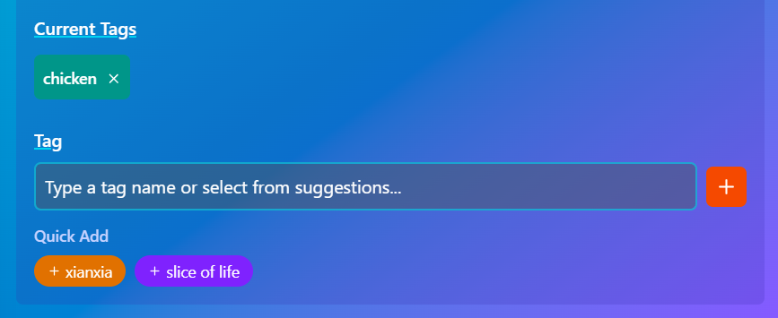

To access a **book's details**, select it from a **Collection** page and click the `Edit Book` button in the details section, as highlighted below.

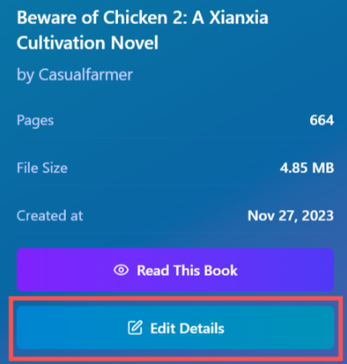

Within the **book details**, you can modify the book's _title_, _author_, _thumbnail_, **shelf**, **collection** and **tags**. 

You can also delete the book from your library by clicking the `Delete this book` button, as shown below.

> [!IMPORTANT]
> 
> Deleting a book from the library will **not** delete the _original_ PDF file from your computer.

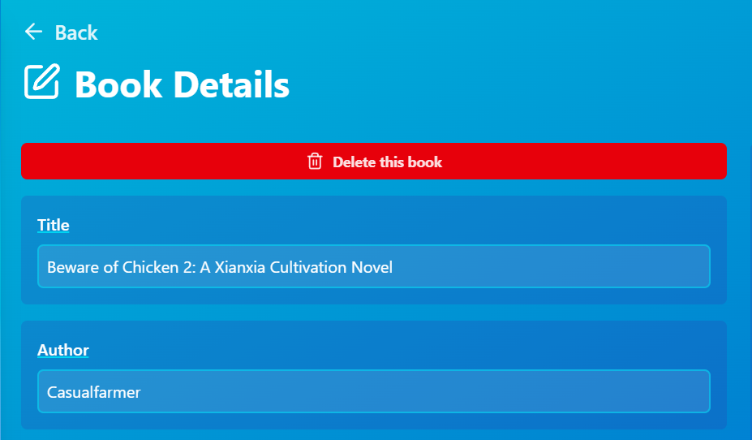

You can replace the book's thumbnail by hovering over the current one, and clicking to upload a new image.

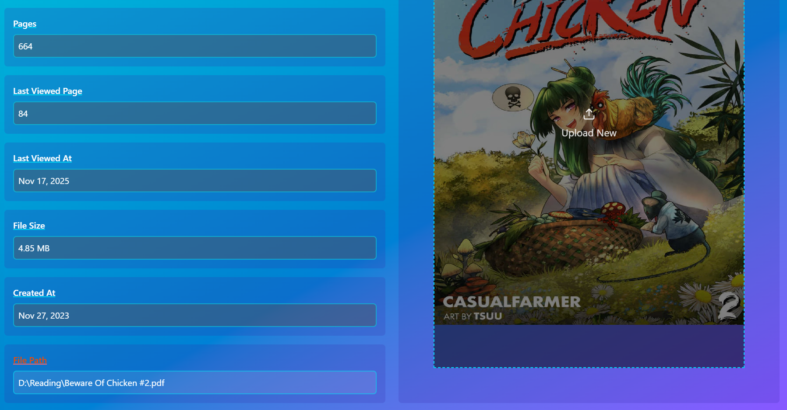

Remember to click on the `Add Changes` button at the bottom of the page to persist changes.

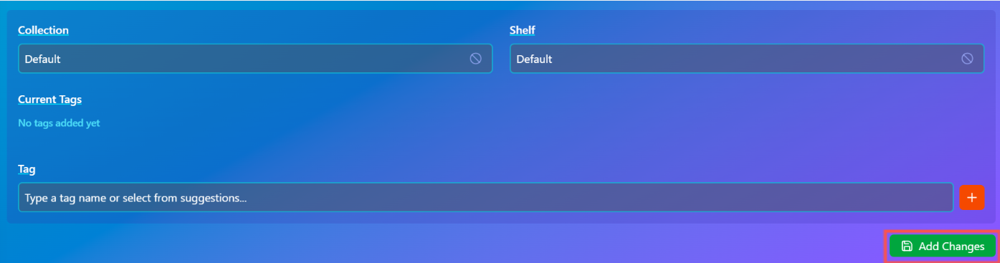

#### Search and Filter

You can navigate to the **Search** page using the `Search` **side menu** button. Then you are directed to a page as shown below.

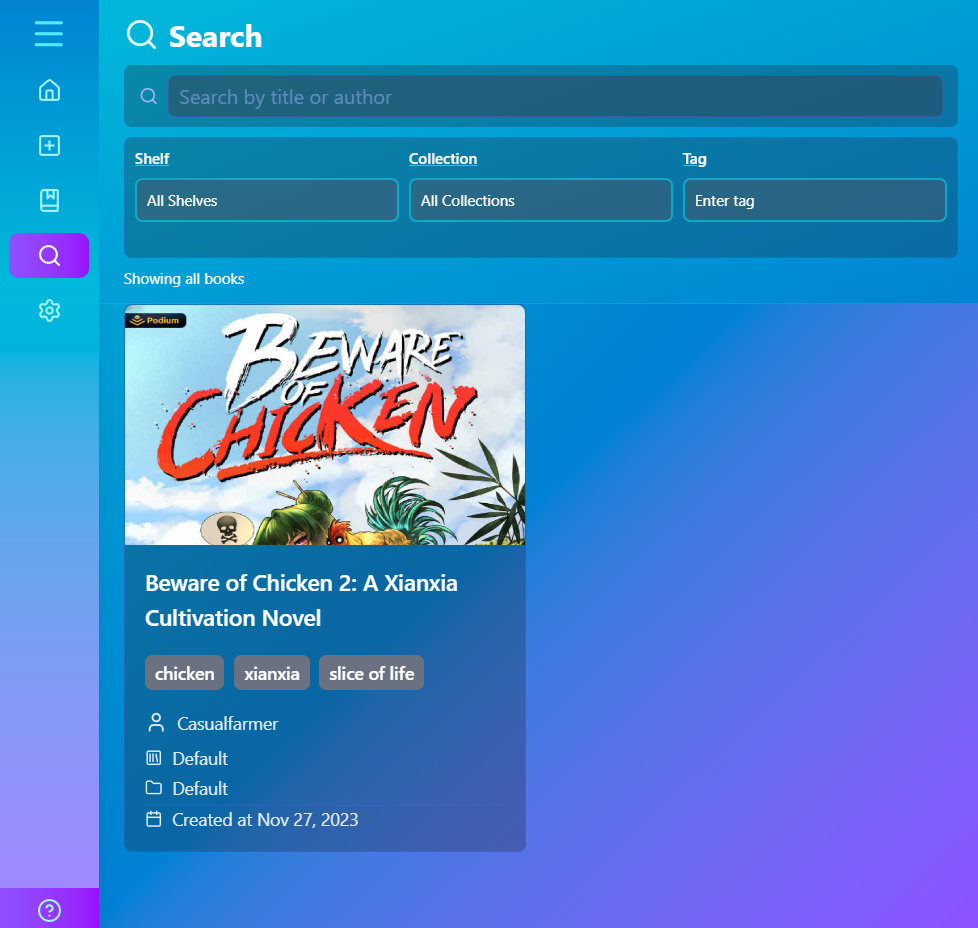

All books that have been uploaded are shown here, each as a card.

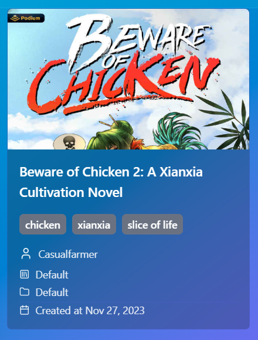

Here are the information placements, in order from top:
- Title
- Tags
- Author
- Shelf
- Collection
- Creation date

Clicking on a book card will redirect you to the **View** page to start reading.

**Using Filters**

Use the search filters to narrow down the results and find a specific book or a group of similar books.

- Search Bar

    Use this to find books by their **title** or **_author_**. 

    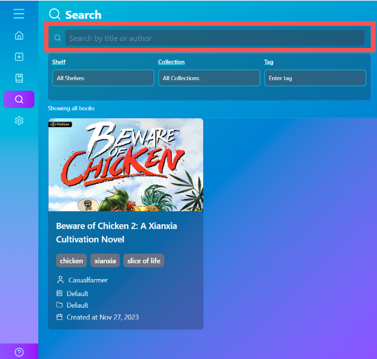

- **Shelf** filter 

    Use this to show only the books belonging to a specific shelf. You can select from your existing shelves.

    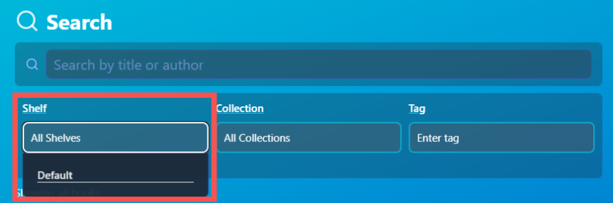

- **Collection** filter

    Use this to show only the books belonging to a specific collection. You can select from your existing collections.

    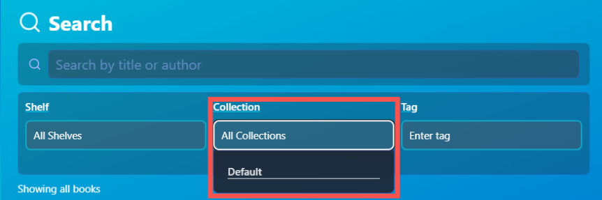

Selecting a collection first will **automatically select** the shelf it belongs to, and selecting a shelf will **limit** the collections that you can filter to only the ones within it.

- **Tag** filter 
    
    Use this to show only books that contain **all** of the selected tags. You can select one or more tags from your existing list.

    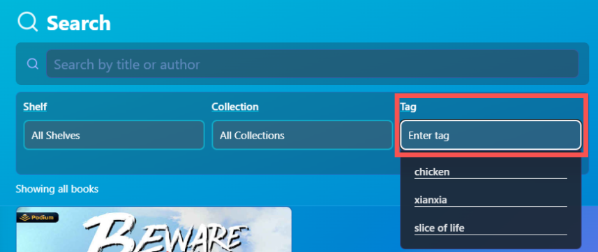

You can apply any combination of these filters to refine your search. Only apply the filters you need to find your books.

#### Settings

> [!NOTE]
> 
> The number of adjustable settings is currently limited, but more options are planned for future updates.

You can navigate to the **Settings** page using the `Settings` **side menu** button. Then you are directed to a page as shown below.

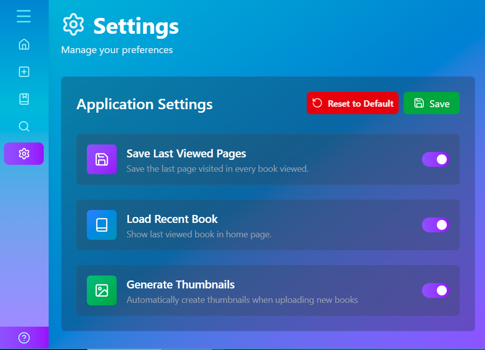

The section shown above is the **Application Settings**, which give control over application-wide changes.

At the top, you will find two buttons:
- `Reset to Default` reverts all settings to their original values.
- `Save` saves any new changes you have made.

The following settings are available:

- `Save Last Viewed Pages`

    When **_toggled_** on, the application will remember the last page you were viewing in a book. When you reopen that book, it will automatically return to that page.

- `Load Recent Book`
    
    When **_toggled_** on, the Home page will display a section with your most recently viewed book, allowing you to quickly resume reading.

    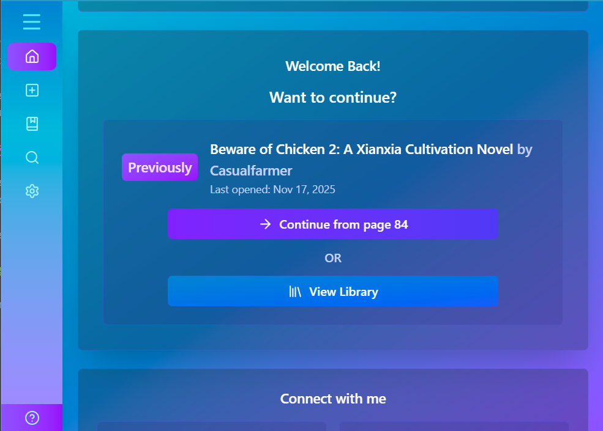

- `Generate Thumbnails`     
    
    When **_toggled_** on, a _thumbnail_, a screenshot of the first page, will be automatically generated for every book you upload.
